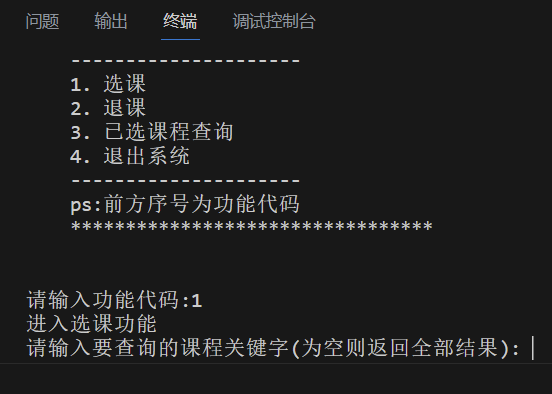
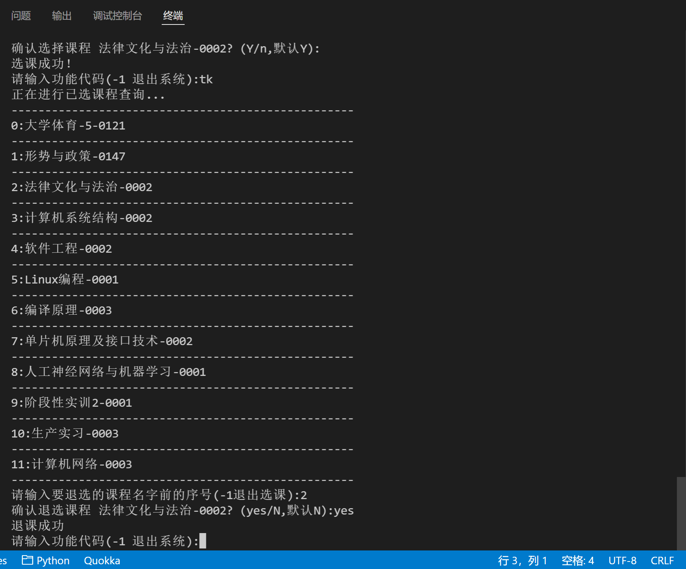

<div align="center">

# 重庆理工大学抢课小助手

*本脚本暂时处于测试阶段，教务系统的登录账号密码还没有查找完善，因此**暂时无法使用**，仅用于研究学习，禁止用于个人盈利。*

###### 🎈 代码修改，以及请求参数配置具体详见:[正方教务选课系统API分析文档](https://github.com/shaxiu/ZF_API)

###### 💡 源码修改自:[南京工业大学抢课小助手](https://github.com/shaxiu/njtech_grabber)

---

</div>

## 功能

由于2021-2022第二学期选课改为分年级分时段
因此本抢课助手有了用武之地，具体功能如下:

- [x] 跨越时段限制选课，即当高年级可以选课的时候，低年级也可进行选课
- [x] 跨越限制进行退课，即页面不允许退课时，也可进行正常退课
- [x] 已选课程查询
- [x] 自动获取cookie
- [x] 自动获取`njdm_id`、`xkkz_id`、`xkxnm`、`xkxqm`
- [x] 支持主修课选课
- [ ] 支持体育课选课
- [ ] 支持多线程暴力抢课

## 效果图

<div align="center">
    
    
</div>

## 使用方法

默认已安装好 ***Python3***

### 安装库

```shell
pip install configparser requests rsa bs4
```

### 脚本配置

```ini
[accountConfig]
userName = 学号(未确认)
passWord = 密码(未确认)
[baseConfig]
baseUrl = https://jwxt.cqut.edu.cn
xkkz_id = null
kklxdm = null
xkxnm = null
xkxqm = null
njdm_id = null
zyh_id = null
xsbj = null
isEnglishCourse = false
```

**使用前配置**

- 将 `config.ini` 与软件脚本放于同一目录下
- 将配置文件中的 `userName`、`passWord` 改为自己的用户名和密码(*当前无效*)
- 将 `baseUrl` 改为学校教务管理平台对应域名地址(对于CQUT已经配置好)
- 其他参数无需更改

### 运行

在当前目录中 `Shift + 鼠标右键` 选择 `在此处打开命令窗口` ，将 `Mainapp.py` 拖入其中并回车即可运行

**进阶玩法**

- 若学校进行分年级分时段选选修课，例如 22 级可以进行选课而作为 23 级的你无法选课/只可以选主修课
- 你可以通过修改参数~~欺骗后台~~ ，~~假装自己是22级的~~
- 修改 `njdm_id` : 如 `2023` → `2022`
- 修改 `kklxdm` : `01`为主修课，`10`为选修课，`07`为拓展英语课(*ps:每个学校不同，仅供参考*)
- 修改 `xkkz_id` : 该参数可以找对应有权限选课的高年级/低年级同学要，每一轮次选课固定
- 其他参数配置具体详见:[正方教务选课系统API分析文档](https://github.com/shaxiu/ZF_API)

## 卡bug的简易方法

注：方法主要针对分年级分时段选课，未到时间的用户无法进入通识选修课的界面的问题(前提是用户可正常进入主修课选课界面)

1. `F12` 查看网页代码，将 `id='kklxdm'` 的input框的 `value` 改为 `10`。其中 `10` 对应通识选修课，`01` 对应主修课选课

2. 修改完成后点击搜索，发现课程列表出现通识选修课，但无法正常点击展开课程进行选课

3. 将 `id='xkkz_id'` 的input框的 `value` 改为 `D8243C19A3C0239AE0530264A8C00F27` (动态值，以具体情况为准)

4. 将 `id='njdm_id'` 的input框的 `value` 值改为允许现在选网课的年级如 `2022`

5. 再次点击课程，发现可以正常展开并进行选课
